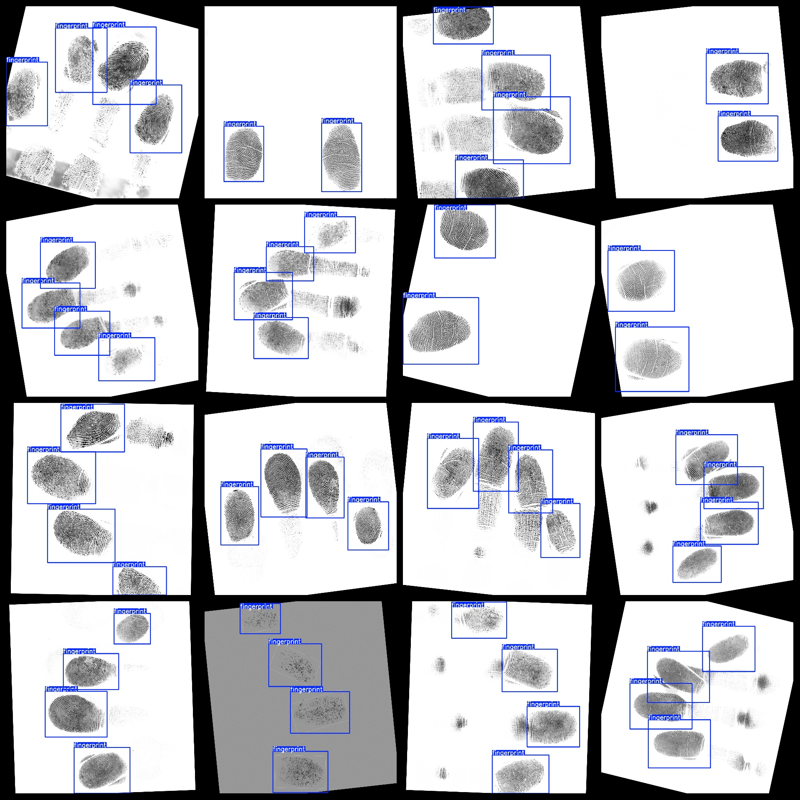

# Fingerprint Detection Dataset 1294 imagesVOC+YOLO format

The fingerprint detection dataset consists of 1294 images in both VOC and YOLO format.

The dataset follows the Pascal VOC format combined with YOLO, without a separate txt file for segmentation paths. It only includes jpg images along with their corresponding VOC format xml files and yolo format txt files.

Number of images (jpg files): 1294

Number of annotations (xml files): 1294

Number of annotations (txt files): 1294

Number of annotation categories: 1

The repository where the dataset is stored is: datasets_sl

Annotation category name: ["fingerprint"]

Number of boxes per class:

- Fingerprint boxes = 4354
- Total boxes = 4354
- Number of images per box:
  - Fingerprint images = 1294

Image resolution: 1600x1500

Annotation tool used: labelImg

Dataset enhancement status: Yes

Annotation rules: Draw bounding boxes for each category

Important note: The dataset does not include splitting into training, validation, and test sets; users must do so themselves.

Special declaration: This dataset does not guarantee any accuracy in trained models or weight files.

## Images

---

Here is a pay link on Stripe (https://buy.stripe.com/3cs8yP7sY87d0vu9AB). Please contact me lonlonago@foxmail.com after funding $89, and I will send you a complete data files, thank you!

